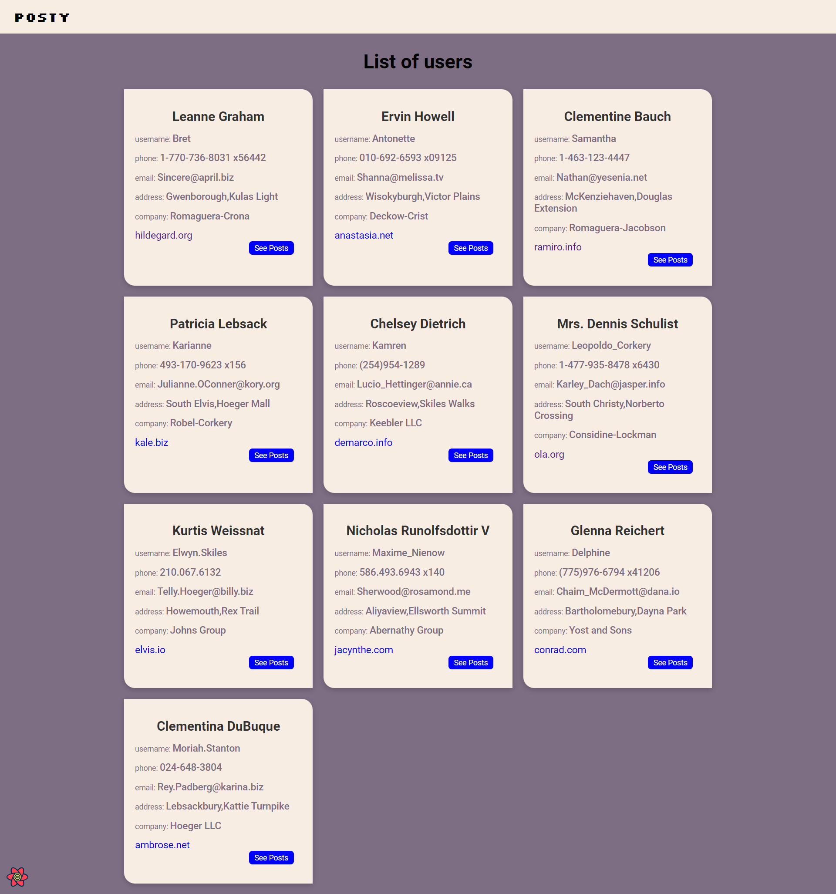
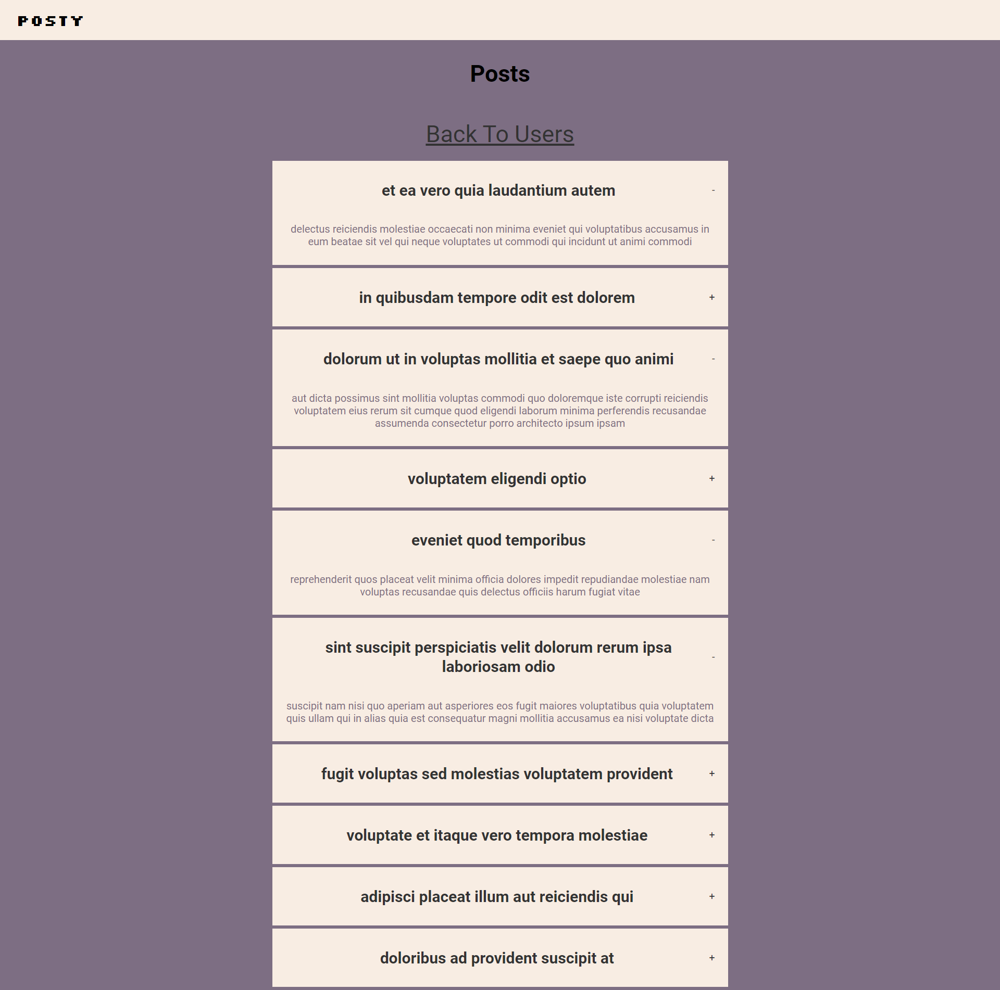

# Posty


## Project Description

> list of user with their information contain a button that shows their posts in Accordion View.

Link <https://willowy-faloodeh-1554ab.netlify.app/>



## installation

you can download a zip file of project through green button Code then choose Download ZIP.

or you can clone it.

```cli
git clone git@github.com:HassanTAli/fixed-solution-task.git
```

after installation run following commands.

```cli
cd fixed-solution-task
npm install
npm start
```

## Additional Notes

- Fonts
  - Roboto
  - Silkscreen for Logo
- styling
  - CSS module for each component and page
  - main App.css contain mostly used class
